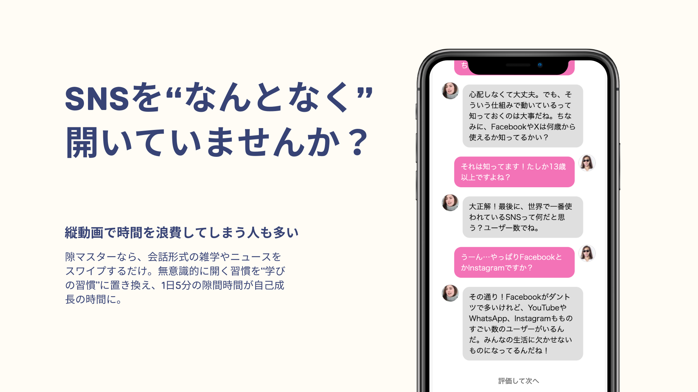
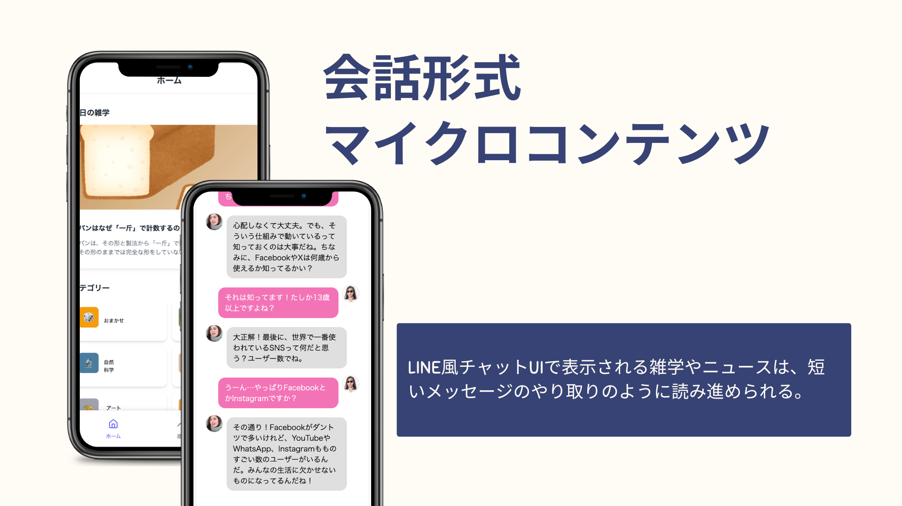
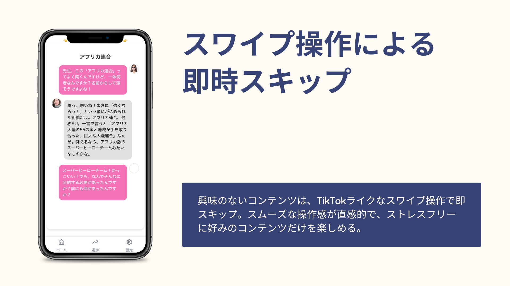
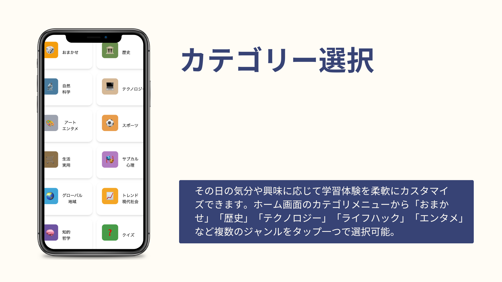
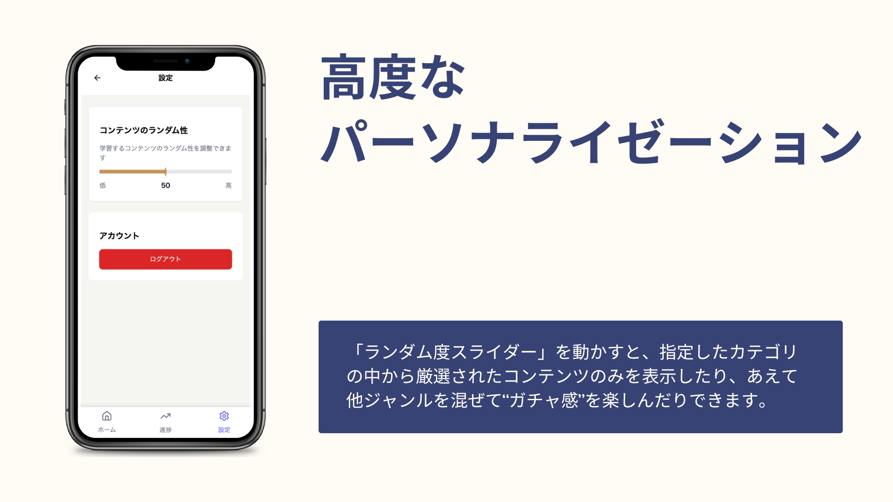
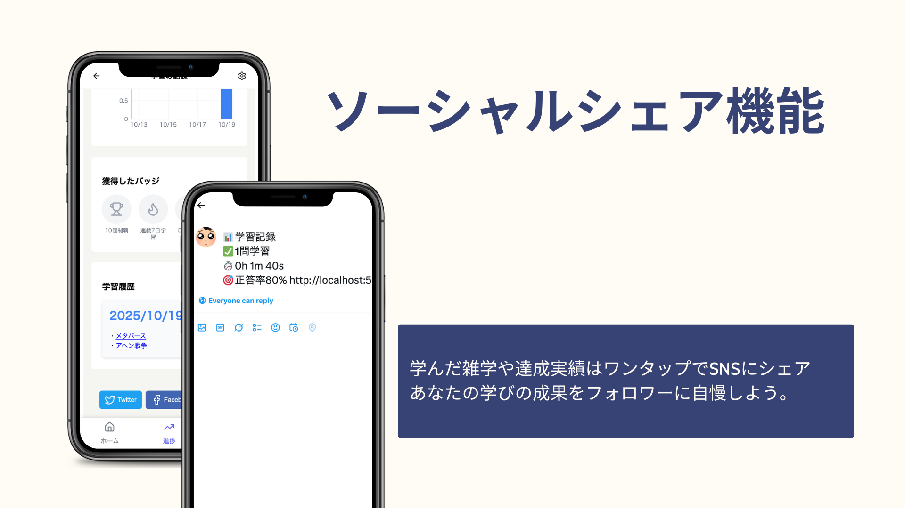
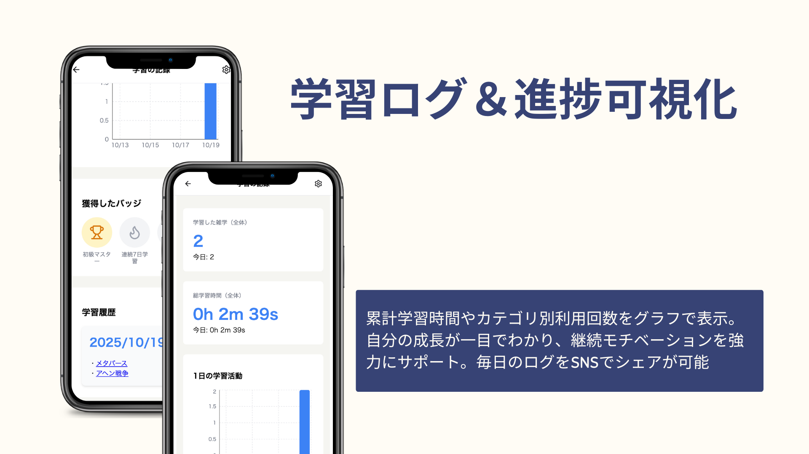

# 隙マスター
## 製品概要

### 背景(製品開発のきっかけ、課題等）
##### 開発のきっかけ
昨今、Instagram、TikTok、YouTubeなど、縦スワイプ型のSNSが日常に浸透しています。

しかし多くの人が、「後で振り返ると何も残らない時間を過ごしていた」という後悔を抱えています。その背景には、以下の要因があります。
* パーソナライズされたレコメンド：自分の興味に合ったコンテンツが次々と流れてくるため、やめどきが分からない
* マイクロコンテンツ設計：一つ一つが短く、深く考えずに消費できるため時間感覚を失う
* 直感的な操作性：スワイプだけで次々と新しい刺激を得られる中毒性
こうしたSNSの「強み」は、同時に「無意識的な時間浪費」を生み出す構造でもあります。
### 既存サービスの検討
##### 既存の生産的アプリの限界
* Duolingoやニュースアプリは「意識的に開く」必要がある
* 多くの人は隙間時間に「何も考えずSNSを開く」習慣がある
* つまり意識的選択 vs 無意識的習慣の戦いで、後者が圧倒的に強い
##### デジタルデトックスアプリの限界
* 既存アプリ（Forest、one secなど）は「SNS使用を制限・警告する」だけ
* 制限されても「代わりに何をすればいいか分からない」
* 結果、ストレスが溜まり継続できない
##### 課題
既存の学習アプリは「学ぼう」という意識が必要で、デジタルデトックスアプリは「制限」や「警告」ばかり。いずれも無意識的なSNS起動習慣には対処できず、行動変容に結びつかないという課題がありました。
### 製品説明（具体的な製品の説明）
隙マスターは、SNSを"なんとなく開いてしまう"無意識的な習慣を、生産的な学びの習慣へと置き換えるマイクロコンテンツプラットフォームです。会話形式の雑学やニュースをスワイプ操作で手軽に楽しみながら、ユーザー一人ひとりの興味に最適化されたコンテンツを提供します。これらの特徴により隙マスターは、「疲れていても時間を浪費するのではなく、何か自分のためになることをしたい！」というユーザーの向上心を応援する画期的なアプリになっています。
### 特長
#### 1.　マイクロコンテンツ配信
* 雑学・ニュースをLINE風のコミカルな会話形式で配信
  ※今回ニュースに関しては著作権の関係から架空のニュースを用意しています。報道機関等と提携することで気軽に見れるニュースコンテンツを提供することが可能と考えています。
* 1トピックあたり数十秒〜数分で完結

#### 2.　スワイプUI
* SNSと同じスワイプUI、会話形式のマイクロコンテンツ、ワンタップ始まるコンテンツで「同じくらい気軽に開ける」学習体験を提供

#### 3.　カテゴリ選択＆ランダム性調整
* 「おまかせ」「歴史」「テクノロジー」などカテゴリを選択
* 設定画面から自由にランダム性の度合いを設定可能

#### 4.　パーソナライゼーション
* ユーザーのスキップ・高評価履歴を学習し、好みに最適化

#### 5.　ソーシャルシェア機能
* 学んだ雑学をワンタップでTwitterにシェア

#### 6.　学習ログ画面
* 累計学習時間とカテゴリ別利用回数を可視化

### 解決出来ること
#### 課題1.　無意識的なSNS起動習慣
既存の生産的アプリは「意識的に開く」必要があるため、「なんとなく開く」SNS習慣には勝てません。
##### 解決策：
SNSと同じスワイプUI、会話形式のマイクロコンテンツで「同じくらい気軽に開ける」学習体験を提供。無意識的な習慣を、別の習慣に置き換えます。
#### 課題2.　画一的なコンテンツ配信
既存の学習アプリやニュースアプリは、ユーザーの細かい興味に対応しきれず、「自分に合わない」と感じて離脱されがちです。
##### 解決策：
スキップ・高評価データを機械学習で分析し、一人ひとりの興味に最適化されたコンテンツを配信。しかしSNSと異なり、「長時間滞在させる」のではなく「短時間で満足できる」設計（満足度最大化レコメンド）を採用しています。
#### 課題3.　制限だけで代替行動がない
デジタルデトックスアプリは「SNSを使うな」と警告するだけで、代わりに何をすればいいか分かりません。
##### 解決策：
魅力的な学習コンテンツを「代替行動」として提供。制限ではなく、より良い選択肢を用意することで、自発的な行動変容を促します。
### 今後の展望
#### 1.　コンテンツ拡充
* 語学学習、運動、瞑想など多ジャンルのマイクロコンテンツ実装
#### 2.　自動生成パイプラインの構築
* GPT-4による高品質雑学・学習コンテンツの大量自動生成
#### 3.　ニュース自動生成プログラムの作成
* 報道機関と連携するなど著作権的な問題を回避した上で、気軽に見れ、信頼できるニュースコンテンツの生成
### 注力したこと（こだわり等）
「縦スワイプ型のSNSを開きたくなるけれども、何かためになることをしたい！」と考えているターゲット層に受け入れられるような、とにかく「気軽に」開けるアプリの作成
  具体的には
* 「ワンタップでコンテンツが始まる」
* 「気に入らなかったらすぐにスキップできる」
* 「ユーザーの趣向が更新されていき、興味のあるコンテンツが優先的に表示される」アルゴリズムは一番下に記載
* 「会話形式で一度に見る文字数を抑える」
* 「コミカルで楽しくみれる会話内容」
* 「クイズ形式で楽しく学習」
* 「進捗を可視化することで、自分がどれだけ隙間時間を有効活用できているかが分かる」
* 「獲得できるバッチによってモチベーションが維持される」
* 「SNSへのシェア機能よってモチベーションが維持される、他SNSからの流入」
## 開発技術
### 活用した技術
#### API・データ
* Firebase
* AWS S3
* Gemini API
#### フレームワーク・ライブラリ・モジュール
* React Typescript
#### デバイス
* スマートフォン
* タブレット
### 独自技術
#### ハッカソンで開発した独自機能・技術
* アプリのUI (特に気軽さにこだわった実装)
* コンテンツをwikipediaAPIを使って自動生成
* 以下に述べるユーザ嗜好プロファイルの更新とコンテンツ推薦システム(関数群はdatabaseフォルダ配下)
#### **明示的フィードバックに基づくユーザ嗜好プロファイルを用いたコンテンツ推薦システム**
##### **1. 概要**
本稿では、コンテンツ推薦システムにおけるユーザの嗜好プロファイルを動的に更新し、それに基づいたコンテンツ推薦を行うための統合的なアルゴリズムを提案する。本手法の中核は、ユーザの興味を表現する10次元の確率分布ベクトル（嗜好プロファイル）である。コンテンツの推薦時には、この嗜好プロファイルと各候補コンテンツの特徴ベクトルのコサイン類似度を算出し、スコアの高い順に提示する。その後、ユーザからの星評価（1～5）およびスキップというフィードバックを統一的に扱い、プロファイルを逐次更新する。更新プロセスでは、プロファイルベクトルの非負性および正規性を保証するクリッピング・正規化ステップを導入し、モデルの安定性と解釈可能性を維持する。
***
##### **2. モデルと記法の定義**
**2.1. 嗜好プロファイルベクトル ($P$)**
ユーザの嗜好を表現する10次元の実数ベクトル。各要素 $P_i$ は、対応するカテゴリへのユーザの興味の度合いを示し、以下の制約を満たす。
$$P = [P_1, P_2, \dots, P_{10}]^T \quad \text{s.t.} \quad \sum_{i=1}^{10} P_i = 1, \quad P_i \ge 0$$
ベクトルの各次元は、以下のカテゴリに対応する。
1.  社会・歴史
2.  自然・科学
3.  テクノロジー
4.  アート・エンタメ
5.  スポーツ
6.  生活・実用
7.  サブカル・心理
8.  グローバル・地域
9.  トレンド・現代社会
10. 知的・哲学
**2.2. コンテンツ特徴ベクトル ($V$)**
コンテンツが属するカテゴリを表現する10次元のOne-Hotベクトル。
**2.3. ユーザアクション ($A$) と重み関数 ($w(A)$)**
ユーザのアクション $A$ は、5段階評価 $\{1, 2, 3, 4, 5\}$ または `skip` のいずれかとする。アクションの意図を数値化するため、重み関数 $w(A)$ を以下の表のように定義する。
| アクション $A$ | 重み $w(A)$ | 意味付け               |
| :--- | :---: | :--- |
| **5-star** | **+2.0** | 非常に強い肯定       |
| **4-star** | **+1.0** | 肯定                 |
| **3-star** | **0** | 中立（更新なし）     |
| **2-star** | **-1.0** | 否定                 |
| **1-star** | **-2.0** | 非常に強い否定       |
| **skip** | **-1.0** | 否定（興味なし）     |
**2.4. 学習率 ($\alpha$)**
更新の強度を制御するハイパーパラメータ。$0 < \alpha \le 1$ の範囲で設定する。
***
##### **3. コンテンツ推薦（ランキング）手法**
ユーザに提示するコンテンツは、ユーザの現在の嗜好プロファイル $P$ との関連性が高い順に選択される。この関連性の尺度として**コサイン類似度**を用いる。
未読の各候補コンテンツのベクトルを $V_{item}$ としたとき、推薦スコアは以下のように計算される。
$$\text{score}(P, V_{item}) = \frac{P \cdot V_{item}}{\|P\| \|V_{item}\|} = \frac{\sum_{i=1}^{10} P_i V_{item_i}}{\sqrt{\sum_{i=1}^{10} P_i^2} \sqrt{\sum_{i=1}^{10} V_{item_i}^2}}$$
システムは、全候補コンテンツに対してこのスコアを算出し、スコアの高い順にランキングを作成してユーザに提示する。なお、ユーザーはランダム度パラメータを設定でき、それに応じて関連コンテンツを提示している。
***
##### **4. 嗜好プロファイルの更新アルゴリズム**
ユーザが推薦されたコンテンツに対してアクション $A$ を行った際、現在の嗜好プロファイル $P_{old}$ は、以下の3ステップを経て新しいプロファイル $P_{new}$ に更新される。
**入力**: 更新前プロファイル $P_{old}$、コンテンツベクトル $V$、ユーザアクション $A$
**出力**: 更新後プロファイル $P_{new}$
**Step 1: 仮プロファイルの算出**
$$P_{provisional} = P_{old} + \alpha \cdot w(A) \cdot V$$
**Step 2: 非負制約の適用（クリッピング）**
$$P_{clipped_i} = \max(0, P_{provisional_i}) \quad \text{for } i=1, \dots, 10$$
**Step 3: 正規化**
$$P_{new_i} = \frac{P_{clipped_i}}{\sum_{j=1}^{10} P_{clipped_j}}$$ （編集済み） 

os_2519 へのメッセージ

Return で改行